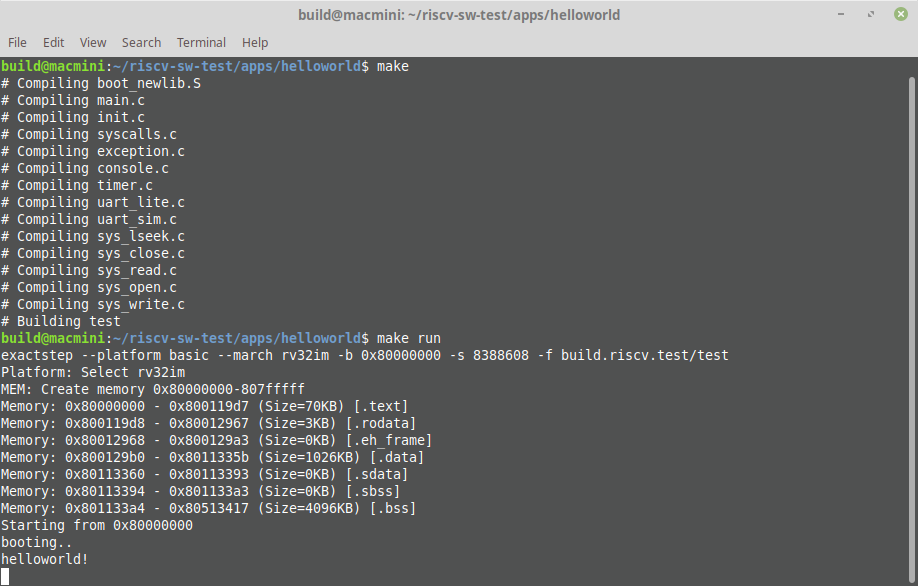

# riscv-sw-test - Newlib based RISC-V demos

Github: https://github.com/ultraembedded/riscv-sw-test

This is an example project using Newlib for RISC-V, with some basic initialisation, drivers and build infrastructure.

## Cloning
This repo contains submodules, so to clone everything;
```
git clone --recursive https://github.com/ultraembedded/riscv-sw-test.git
```

## Building

This project uses *make* and the RISC-V toolchain.
Make sure you have the RISC-V toolchain available on your PATH, then;

```
cd apps/helloworld
make
```

# Running on a simulator
This SW can run on my RISC-V ISA simulator *ExactStep*: https://github.com/ultraembedded/exactstep



